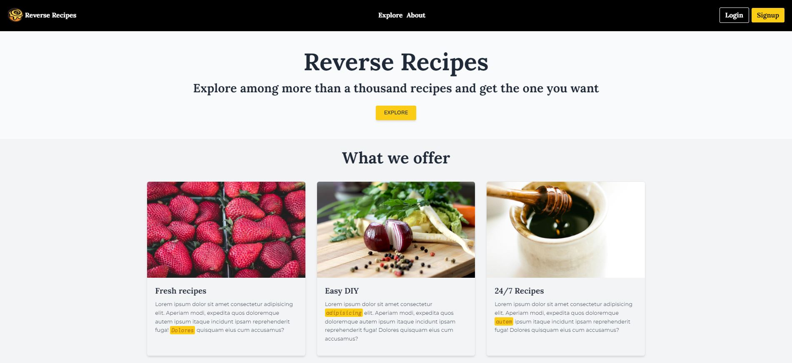

    <b>🍕🍔🍟 Reverse recipes. A basic web app to manage a database of recipes 🍕🍔🍟.</b>

## Table of contents 👇

- [✨ How to install](#-how-to-install)
- [🚀 Git Workflow](#-git-workflow)
- [🕸️ How to contribute](#-how-to-contribute)
- [🚩 Cheatsheet](#-cheatsheet)
- [🔒 Database](#-database)

## ✨ How to install

1. `Git clone`.
2. Execute `npm install and composer install`.
3. Copy *.env.example* file to *.env* on the root folder.
4. Change database name to `laravel_vue_reverse_recipes`.
5. Create a file `.env` in the root and copy the content of `.env.example` inside it.
6. Run `php artisan key:generate`. 
7. Run `php artisan migrate`.
8. Run `php artisan serve`.

To run scripts from package.json when files change (TailwindCSS) execute `npm run watch` in another terminal. **Don't close it.**

### 🚀 Git Workflow

- **Main branch**: this branch includes the last version of the web (production).
- **Develop branch**: this branch has all the changes waiting to be merged into the *main branch*.
- **Feature branch**: new feature until it is complete.

## 🕸️ How to contribute

If you want to make changes into the project, do the following:

1. Create a new feature branch, for example, `feature/create-navbar`.
2. Make changes and test them.
3. If everything is correct, commit those changes and push to Github.
4. Switch to the `develop` branch and merge those changes. For example, `git checkout develop`, to switch to develop branch, and then `git merge feature/create-navbar`.
5. Test everything and, if it's ok, commit and push to GitHub.
6. Once several changes have been made to the `develop branch` it's time to merge with `main` to create stable version of the project. `git checkout main` and `git merge develop`. Then `git push`.
7. Delete the feature branch `git branch -d feature/create-navbar`.

## 🚩 Cheatsheet

- Show branches: `git branch`
- Create branch: `git branch <branch>`
- Create branch and switch: `git checkout -b <branch>`
- Switch to another branch: `git checkout <branch>`
- Delete branch: `git branch -d <branch>`
- Push branch to Github: `git push --set-upstream origin <branch>`
- Delete remote branch: `git push origin -d <branch>`
- Update remote branches: `git remote update origin --prune`
- Create tag: `git tag v0.1.0`
- List tags: `git tag -l`
- Push tag to Github: `git push origin <tag>`

To create the **storage link** you need to type `php artisan storage:link` and then change the current `APP_URL` inside `.env` file to `APP_URL=http://localhost:8000` or whatever you use.

## 🔒 Database

In order to create database you need to run `php artisan migrate`. After that, execute `php artisan db:seed`. Make sure you only execute that last command **once**.

